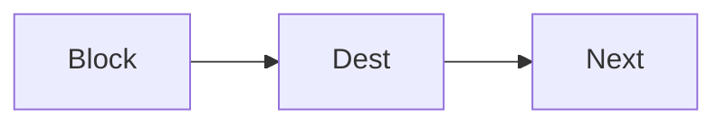
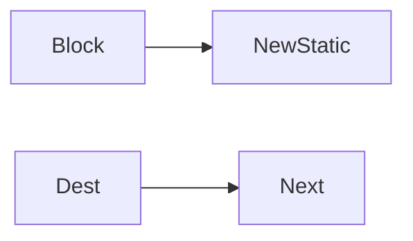
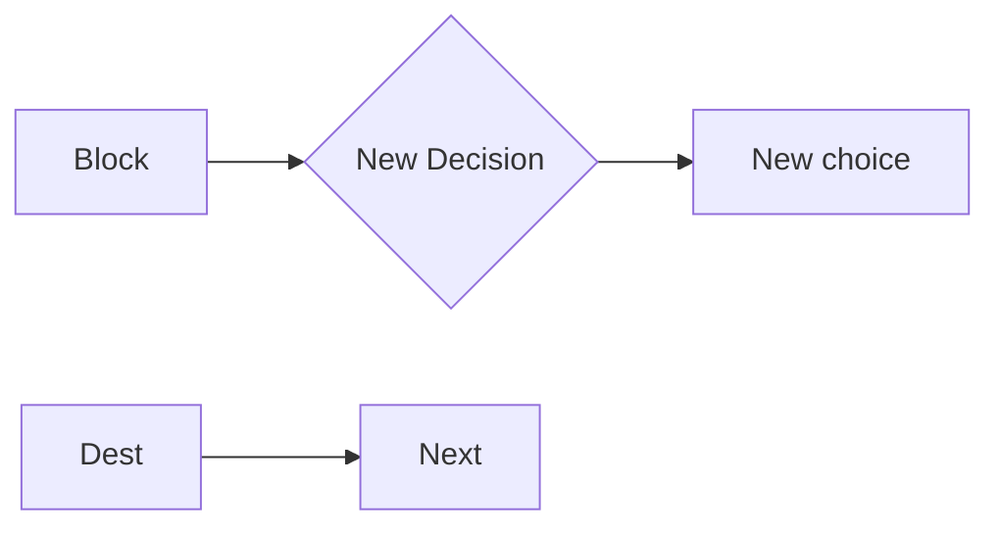

# Task 22 implementation plan: floating node inspectors and explicit destinations

## Baseline and outcome

Implement from task 21's completed source on `staging` at merge commit `ab41fb0`. That baseline contains the editor in `index.html` and `viewer.ts`; the current `develop` source does not.

Replace the shared `#nodeActions` toolbar with a floating inspector for the selected Mermaid node. The inspector must let a user edit node text, perform only the graph operations valid for that node type, and explicitly choose where a static or choice block leads. A user must never need to edit `.mmd` text to choose between terminating a path, creating a new destination, or connecting to an existing destination.

Keep `viewer.ts` as the source of truth and rebuild the committed `viewer.js`. Put browser behavior coverage in `tests/index.html.test.ts`; retain the existing task-21 build/parity tests.

## Terminology and graph invariants

The UI calls task 21's internal `question` kind a **Decision block**, its `block` kind a **static block**, and its `choice` kind a **choice block**.

- A Decision has one or more outgoing choice branches. New Decisions in task 22 start with exactly one explicit choice.
- A static or choice block has zero or one outgoing edge. Only these two kinds get a Destination menu.
- A static or choice may lead to a static or Decision block, including an ancestor; intentional cycles are valid and require no warning.
- A static or choice may not lead directly to a choice. A Decision may not lead directly to a static or another Decision.
- Generated IDs are unique across every declared or referenced node.
- Removing an edge never recursively deletes its former destination. The old destination and everything downstream remain in the source as an orphaned path.

Use these defaults for newly generated nodes:

```ts
const NEW_LABELS = {
  static: 'New static block',
  decision: 'New Decision',
  choice: 'New choice',
};
```

## Inspector structure and layout

Use one reusable DOM inspector whose title and visible controls are derived from the selected node kind. The following is structural guidance; IDs may vary if tests use stable `data-action` attributes instead.

```html
<aside id="nodeInspector" role="dialog" aria-labelledby="nodeInspectorTitle" hidden>
  <h2 id="nodeInspectorTitle"></h2>

  <label class="inspector-text-row">
    <span>Text:</span>
    <input id="nodeTextInput" type="text" />
  </label>

  <div id="inspectorActions" class="inspector-grid">
    <!-- Render only actions valid for the selected kind. -->
  </div>

  <div class="inspector-grid inspector-history">
    <button data-action="undo">Undo</button>
    <button data-action="redo">Redo</button>
    <button data-action="dismiss" class="span-2">Cancel</button>
  </div>

  <label id="destinationRow" hidden>
    <span>Destination:</span>
    <select id="destinationSelect"></select>
  </label>
</aside>
```

Normal-state controls and order must match the mockup:

- Decision block: `Remove | Remove choices`; `add choice`; `insert static block before`; `insert Decision & leading choice before`; `Undo | Redo`; `Cancel`.
- static block: `Remove`; `insert static block before`; `add Decision block after`; `insert Decision & leading choice before`; `Undo | Redo`; `Cancel` or `Close`; Destination.
- choice block: `Remove`; `add Decision block after`; `add static block after`; `Undo | Redo`; `Cancel` or `Close`; Destination.

The inspector is a rounded floating card with a two-column grid. Long actions span both columns, Undo and Redo share a row, and Cancel/Close spans both columns. Controls for other node kinds must not exist in the active inspector state; hiding or disabling a global set of irrelevant buttons is insufficient.

Use fixed positioning so opening the inspector never changes document or diagram layout:

```css
#nodeInspector {
  position: fixed;
  z-index: 20;
  box-sizing: border-box;
  border: 1px solid #ddd;
  border-radius: 22px;
}

.inspector-grid {
  display: grid;
  grid-template-columns: repeat(2, minmax(0, 1fr));
  gap: 12px;
}

.span-2 { grid-column: 1 / -1; }
```

Position the card beside the selected SVG node using `getBoundingClientRect()`. Prefer the node's right side, fall back to its left, then clamp both axes inside the visible bounds of `#output`. Reposition on selection, render, `#output` scroll, and window resize. Opening, moving, closing, and reanchoring the inspector must not write `scrollLeft` or `scrollTop`.

## Destination menu

Show Destination after Cancel/Close for every static and choice selection, whether terminal or connected. Do not show it for a Decision.

Build options in this exact order:

1. `Terminal`
2. `New static block`
3. `New Decision block`
4. Every existing static and Decision node in `.mmd` source order

Always format an existing-node option as `label (nodeId)`. Exclude the selected node. Deduplicate by node ID, but do not filter descendants: connections that create cycles are allowed. The current sole destination is selected; a terminal node selects `Terminal`. Selecting the current value is a no-op.

```ts
type DestinationValue =
  | 'terminal'
  | 'new-static'
  | 'new-decision'
  | `node:${string}`;

function destinationOptions(sourceId: string, graph: EditorGraph) {
  const seen = new Set<string>();
  return [...graph.nodes.values()]
    .filter(node => node.id !== sourceId)
    .filter(node => node.kind === 'block' || node.kind === 'question')
    .filter(node => !seen.has(node.id) && !!seen.add(node.id))
    .map(node => ({
      value: `node:${node.id}` as const,
      label: `${node.label} (${node.id})`,
    }));
}
```

`EditorGraph.nodes` must retain source declaration/reference order so this function produces stable source order.

Destination selection is an immediate, validated, saved editor action:

```ts
async function applyDestination(sourceId: string, value: DestinationValue) {
  const graph = editorGraph();
  assertStaticOrChoiceWithAtMostOneOutgoing(sourceId, graph);

  if (value === currentDestinationValue(sourceId, graph)) return;
  if (value === 'terminal') return commitEditorSource(removeOutgoing(sourceId, graph));
  if (value === 'new-static') return commitNewStaticAfter(sourceId, graph);
  if (value === 'new-decision') return commitNewDecisionAfter(sourceId, graph);
  return commitEditorSource(replaceOutgoing(sourceId, value.slice(5), graph));
}
```

- `replaceOutgoing` removes the source's old outgoing edge and adds `source --> chosenDestination`.
- `removeOutgoing` removes the sole outgoing edge.
- Both preserve any inline declaration displaced from a rewritten edge line.
- The former target and its downstream source remain untouched and become orphaned.
- A destination commit is exactly one undo entry and one save.
- If the Text field is dirty, commit and save the text first, then commit and save Destination as a second undo entry. Serialize these operations; do not allow overlapping renders or PUTs.

The dismissal button reads `Close` whenever the selected static or choice is terminal and `Cancel` otherwise. Both labels discard only uncommitted Text and close the inspector. They never undo a committed node creation or connection; Undo performs that job. Escape and an empty-diagram click behave the same way.

## Add-after creation workflows

The inspector buttons and the Destination menu's `New...` options must call the same functions and produce identical history, persistence, selection, and focus behavior.

Adding a static after a connected source does **not** splice into the former edge:



becomes the equivalent of:



`NewStatic` is terminal. The former `Dest --> Next` branch remains in the file, disconnected from `Block`. Move the inspector to `NewStatic`, focus/select its Text input, and after Enter leave its Destination menu ready for the next selection.

Adding a Decision after a source similarly replaces the old outgoing edge and creates exactly one explicit terminal choice:



Move the inspector to `NewDecision` and focus/select its Text field. Enter commits its text as its own history action, then moves the inspector to `NewChoice` and focuses the Destination menu. Pressing Enter with unchanged default text advances without adding an empty history entry.

`add choice` creates exactly one explicit terminal choice, even when the Decision currently uses labelled edges. Move to the new choice inspector and focus Destination. Normalizing a labelled branch does not count as the requested new choice: the final graph must contain one more branch than before the action.

Each add-after structural creation is committed immediately as one history action. If the source had a destination, that destination becomes orphaned immediately. Cancel/Close afterward only closes the inspector.

## Insert-before and removal workflows

Insert-before remains automatic and does not invoke Destination:

- `insert static block before Target` redirects every incoming `P --> Target` edge to `P --> NewStatic`, adds one `NewStatic --> Target`, and keeps the original edge style/label on the predecessor side where meaningful. If Target has no predecessor, `NewStatic --> Target` creates a new root.
- `insert Decision & leading choice before Target` redirects incoming edges through `NewDecision --> NewChoice --> Target`. If Target is a root, NewDecision becomes the new root.
- After either insertion, keep Target selected and reanchor its inspector.

Keep task 21 removal rules:

- Decision Remove uses the existing replacement-path preview/cycle/confirm flow. The temporary preview may replace normal inspector controls and has its own confirmation and cancellation controls.
- static Remove reconnects every predecessor to every successor.
- choice Remove deletes that choice and its incident edges, leaving its downstream path orphaned.
- Remove choices removes every outgoing Decision branch representation-independently. Remove labelled outgoing edges directly; remove explicit immediate choice declarations and incident edges; retain all downstream nodes and paths as orphans.
- Removing the selected node closes the inspector. Other structural actions keep or deliberately retarget selection as described above.

## Text editing, history, and persistence

Replace SVG `contenteditable` editing with the inspector's bordered input for all three kinds. Single-click selects; double-click selects and focuses the Text input.

- Enter validates and commits the current input to the selected node declaration, rerenders, saves the current `diagrams/<name>.mmd`, keeps selection, and reanchors the inspector.
- Cancel/Close, Escape, an empty-diagram click, or selecting another node discards uncommitted input.
- Escape must not undo already committed graph changes.
- Escape/Cancel during Decision-removal preview cancels only that preview.
- Escape label text correctly for Mermaid rather than interpolating raw quotes or delimiters.

Use one serialized action queue so rapid Text/Destination changes cannot race:

```ts
function enqueueEditorAction(action: () => Promise<void>) {
  const next = editorActionPromise.catch(() => undefined).then(action);
  setEditorActionPromise(next);
  return next;
}
```

Every commit follows this order: generate candidate source, `await mermaid.parse(candidate)`, update textarea/history, rerender while preserving the viewport, PUT-save, then restore/retarget inspector selection. Failed parse or save leaves the last committed diagram/history intact and reports the error.

Inspector Undo/Redo and the always-visible web-header Undo/Redo buttons use the same full-source history. New commits truncate the redo tail. Disabled state mirrors history availability. Undo/Redo validates, rerenders, persists, preserves the viewport, and keeps the selection only if that node still exists.

Capture the actual desktop scroll owner (`#output` on the task-21 baseline) around render:

```ts
const viewport = { left: outputBox.scrollLeft, top: outputBox.scrollTop };
await render();
outputBox.scrollLeft = viewport.left;
outputBox.scrollTop = viewport.top;
restoreInspectorSelection();
```

## Lossless Mermaid rewriting

Do not extend task 21's current one-edge-per-line assumption. Existing diagrams contain chained and labelled edges, and valid inputs may contain dotted edges and inline declarations.

Represent each parsed edge segment separately while retaining its original line index, segment index, arrow spelling/label, and inline endpoint declarations. When a mutation touches one segment of a chain, emit the untouched segments as equivalent standalone lines rather than dropping the rest of the chain. Preserve comments, blank lines, declarations, class definitions, and unaffected source verbatim.

At minimum, parse and safely rewrite:

```mermaid
A --> B --> C
Q -- "Yes" --> B
A -.-> B
A -. "fallback" .-> B
A["inline"] --> B{"inline decision"}
class A,B someClass
```

When deleting a node, remove it from `class A,B someClass`; delete the directive only if its member list becomes empty. Before any textarea/history/file update, parse the entire candidate with Mermaid. Add regression tests proving no untouched segment, declaration, comment, class member, or orphan branch disappears.

## Required browser tests

Extend the existing CDP harness using fixtures that are restored after every case:

1. Each node kind renders exactly its specified title, Text value, actions, spans/order, and no actions belonging to another kind.
2. Destination appears only for static/choice, below dismissal, with the three special options followed by `label (ID)` nodes in source order and no duplicate entries.
3. Destination reflects Terminal or the current edge; selecting the current value is a history/file no-op.
4. Rewiring and Terminal replace/remove the sole edge, preserve the former downstream branch as an orphan, save once, and undo/redo correctly.
5. Cyclic destinations remain selectable and commit without confirmation.
6. Button and menu creation paths are identical. New static becomes terminal; New Decision has one terminal choice; old destinations become orphaned.
7. New-static focus, Decision-then-choice focus, and add-choice-to-Destination focus follow the workflows above.
8. Dirty Text followed by Destination creates two ordered, persisted undo entries.
9. Terminal static/choice says Close; connected static/choice and Decision say Cancel. Dismissal never undoes committed creation.
10. Insert-before still splices incoming edges; all task-21 removal flows still work.
11. Opening, retargeting, dismissing, rerendering, undoing, and redoing preserve both `#output.scrollLeft` and `#output.scrollTop`; the card remains beside the node and within visible output bounds.
12. Decision/static/choice text edits persist, reload, and remain valid Mermaid.
13. Chained, labelled, dotted, inline-declaration, class, fan-in, fan-out, orphan, and intentional-cycle fixtures remain lossless after every relevant mutation.

Run the full existing suite, rebuild `viewer.js` from `viewer.ts`, and confirm the committed bundle matches the fresh build.
